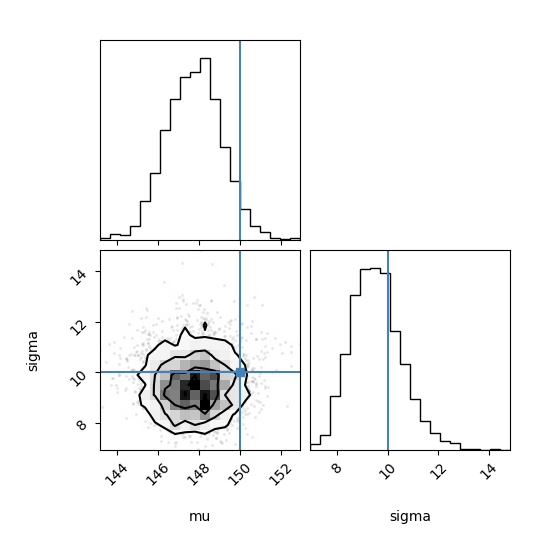

# Machine Learning Homework 4

**Student:** Qunoo A K Taweel
**Course:** Machine Learning
**Homework:** 4

---

## 📌 Problem Description

In this project, we estimate the true brightness (μ) of a distant celestial object and the uncertainty (σ) in observations using Bayesian Inference.

The dataset contains noisy observations that simulate real astronomical measurements.

---

## 📊 Data Generation

The synthetic dataset was generated using:

* True brightness (μ) = 150
* True noise (σ) = 10
* Number of observations = 50

The data is sampled from a normal distribution with added noise.

---

## ⚙️ Method

We applied Bayesian Inference using Markov Chain Monte Carlo (MCMC) with the `emcee` library.

**Libraries used:** numpy, matplotlib, emcee, corner

Steps:

1. Define the log-likelihood function
2. Define the log-prior function
3. Combine them into the log-posterior
4. Run MCMC sampling
5. Extract parameter estimates from posterior samples

The first 500 samples were discarded as *burn-in* to ensure convergence.

---

## 📈 Results

| Parameter      | True Value | Estimated (Median) | 16%    | 84%    | Error |
| -------------- | ---------- | ------------------ | ------ | ------ | ----- |
| μ (Brightness) | 150        | 147.79             | 146.43 | 149.07 | 2.21  |
| σ (Noise)      | 10         | 9.49               | 8.55   | 10.53  | 0.51  |

---

## 📊 Visualization

The corner plot below shows the posterior distributions of μ and σ:

---

## 🧠 Analysis

### Prior Effect

If a very narrow prior (e.g., 100–110) is chosen, the results become biased toward that range even if the true value is 150. This shows that priors can strongly influence the posterior when they are too restrictive.

---

### Effect of Data Size

If the number of observations is reduced (e.g., n = 5), the posterior distribution becomes much wider. This means higher uncertainty and less confidence in the estimated parameters.

---

### Accuracy

The estimated brightness (μ = 147.79) is close to the true value (150), with a small error of 2.21. This shows that the Bayesian method provides good accuracy even with noisy data.

---

### Precision

The estimate of μ is more precise than σ. This is because the mean stabilizes faster with increasing data, while variance estimation depends on squared deviations and is more sensitive to noise. With n = 50, μ converges faster than σ, leading to a narrower uncertainty range.

---

### Correlation

The corner plot shows a slight tilt in the joint distribution of μ and σ, indicating a weak correlation between them. This means the estimates are not completely independent.

---

### Repository Structure

The project repository is organized as follows:

main.py → Python implementation of Bayesian MCMC simulation

README.md → Project description, results, and analysis

Figure_1.png → Visualization (corner plot of posterior distributions)

Only the necessary files are included to keep the repository clean and focused.

---

## ✅ Conclusion

Bayesian inference using MCMC successfully estimates both the brightness and uncertainty of the data. The method is robust to noise and provides both accurate estimates and uncertainty measures. Increasing the number of observations improves precision and reduces uncertainty.
